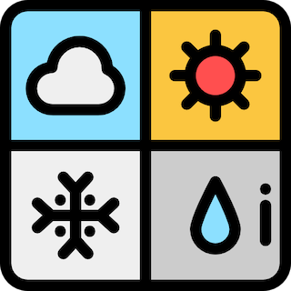

# crssy
ターミナル上に天気予報を出力するCLI

[](https://github.com/YukiKonishi/crssy/actions/workflows/build.yml)
[](https://coveralls.io/github/YukiKonishi/crssy?branch=main)
[](https://codebeat.co/projects/github-com-yukikonishi-crssy-main)
[](https://goreportcard.com/report/github.com/YukiKonishi/crssy)


# 概要
このソフトウェアは天気予報をブラウザで調べるよりも手軽に確認できるようにするために，
コマンドライン上で天気予報を出力するものである．

# 使用方法
```
crssy [OPTION]
OPTIONS
　<場所>  場所の入力をすると, その土地の天気を出力する。
  -v, --version         ソフトウェアのバージョンを出力する。
  -h, --help            このメッセージを出力する。
  -w, --week            日を入力すると, その時の天気を出力する。
```

# インストール方法
```
hogehoge
```
# プロジェクトについて
## 開発者
Konishi Yuki
## ライセンス

## アイコン

## 名前の由来
天気予報のソフトウェアを作るにあたって名前は何がいいかなと考えました．

よく天気予報で見る天気としては曇り・雨・晴れ・雪だな〜と思い，自分の名前の頭文字と合わせてcrssyとなりました．
## バージョン履歴
